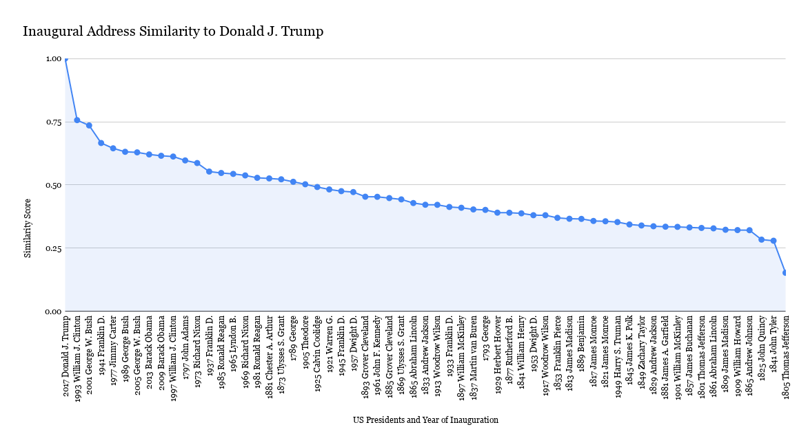
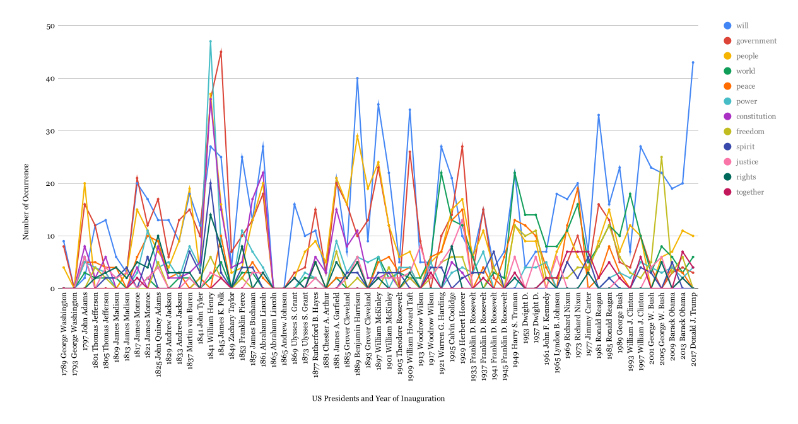
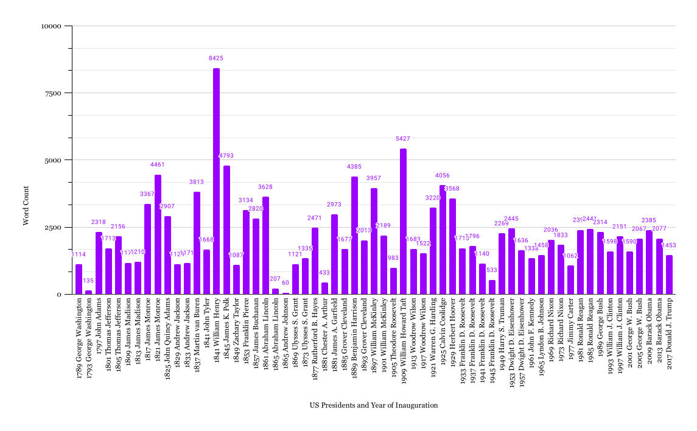
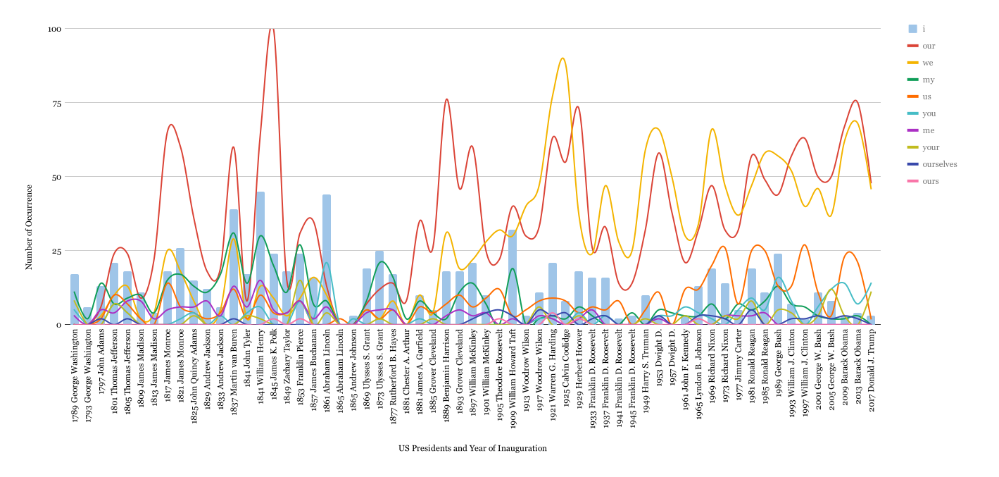
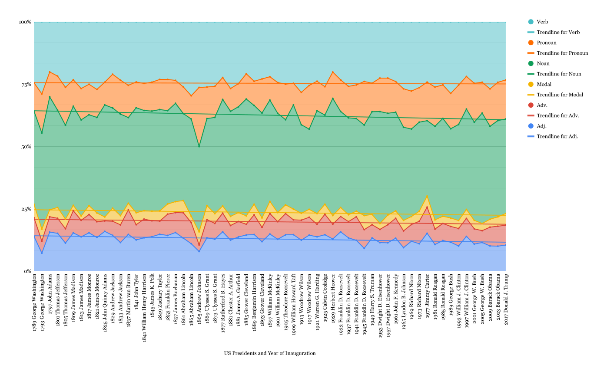

# US Presidential Inaugural Addresses Analysis

02.137 Digital Humanity - Final Project

### Donald J. Trump verses every other US President

### Choice of word

### Total Word Count 

### Usage of pronouns

### Part Of Speech 

